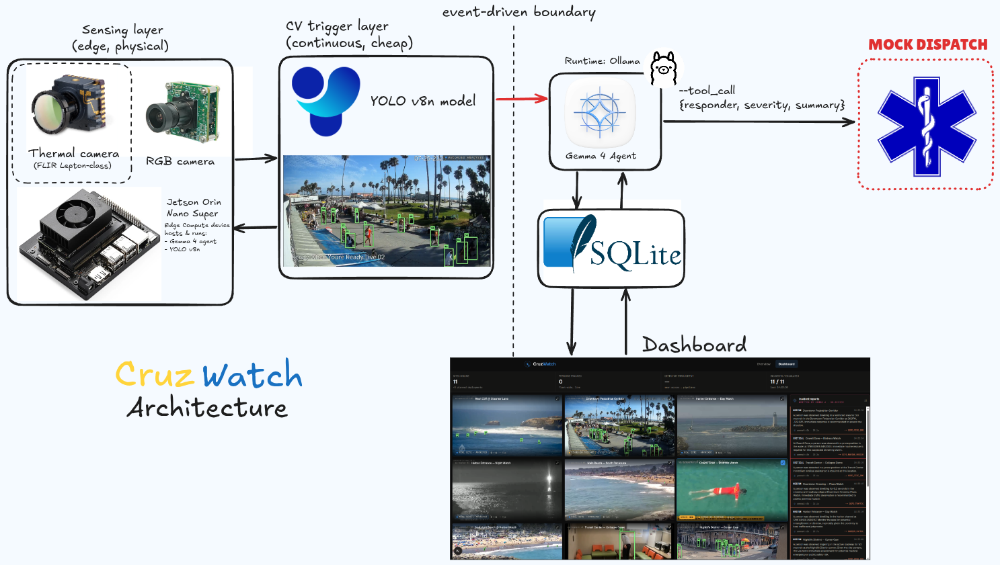

# CruzWatch

Edge hazard monitoring for Santa Cruz. A cheap CV model watches continuously; a local
Gemma 4 agent is invoked **only when a trigger fires**, reasons about the event using
site-specific context, and escalates to a simulated dispatch console.

> **Proof of concept.** Footage is archived or stand-in; escalation is simulated and never
> contacts real emergency services. The CV inference and the local Gemma 4 reasoning are real.



## Run

```bash
pip install -r backend/requirements.txt
ollama pull gemma4:e2b
./run.sh
```

| Service | URL |
| --- | --- |
| Dashboard | http://localhost:3000 |
| Backend | http://localhost:8000/api/sites |
| Mock dispatch | http://localhost:8001/dispatch — **simulated** |

Python 3.11+, Node 20.9+, [Ollama](https://ollama.com). Without Ollama the agent falls back
to a labeled deterministic template. GPU optional — four sites run concurrently on an
RTX 4060 Laptop GPU alongside the model.

## Gemma 4 integration

`handle_hazard` in [`backend/agent.py`](backend/agent.py) runs **gemma4:e2b locally via Ollama**
— the edge-class Gemma 4 variant. On each trigger it:

1. Publishes `agent_input` — the exact payload the model sees (site context + structured
   event, **never pixels**)
2. Streams generation as `agent_token` events, JSON-constrained with `reasoning` first so
   thinking streams before the verdict
3. Parses `{reasoning, severity, escalate, responder, summary}`
4. Calls `escalate()` **only if the model says so**

Measured: identical `zone_dwell` triggers at three sites produced MEDIUM/escalate (downtown),
MEDIUM/escalate (cliff break), and LOW/**no escalation** (routine wader). The site context,
not the CV event, drives the decision — that is the argument for using an LLM here at all.

Warm latency 4–9s per incident (~43 tok/s). A 120s timeout with a visibly labeled template
fallback guarantees a stalled model can never hang the demo.

## Architecture

Everything becomes an event on one append-only in-memory stream
([`backend/events.py`](backend/events.py)); the dashboard is a pure renderer over it. Every
event carries a `provenance` field that drives the honesty badges on screen.

```text
clip / camera ──► YOLO11n + ByteTrack ──► primitives ──► hazard event
                       (real CV)                              │
                                                              ▼
                                          Gemma 4 (gemma4:e2b, local via Ollama)
                                              │ decides severity + escalate
                                              ▼
                                          escalate() ──► mock dispatch :8001
```

**Three primitives, not two detectors.** [`backend/primitives.py`](backend/primitives.py)
implements `zone_dwell` (point-in-polygon + dwell timer), `prone` (box aspect ratio inverts
and holds), and `velocity_anomaly` (per-track speed vs rolling baseline). Each site profile
in [`backend/sites/`](backend/sites/) picks which are armed and with what thresholds. Adding
a seventeenth camera is adding a JSON file — location changes config, never code.

`velocity_anomaly` is implemented but **disarmed on the coastal site**: it fired 98 times in
180s at Steamer Lane, because every surfer catching a wave is a speed spike. Illustrative,
not a validated capability.

Detector output is precomputed by [`backend/render_demo.py`](backend/render_demo.py), never
overlaid live, so the hosted demo and the local one show identical labeled `REPLAY` footage.

## Safety

`escalate()` is the **only** network egress in the codebase, and it asserts its target starts
with `http://127.0.0.1`. The mock dispatch console runs as a separate service on a separate
port so the trust boundary is visible rather than asserted.

## Footage provenance

Six of seven feeds are real cameras at the named Santa Cruz sites (archived or recorded, not
live units) — Surfline Steamer Lane, WebCOOS Walton Lighthouse and Wharf, santacruzharbor.org
day and night. `sc-downtown-01` is a public boardwalk webcam standing in for the location and
is labeled `STAND-IN FOOTAGE` on screen. The badge on every panel says which is which before
a judge has to ask.
